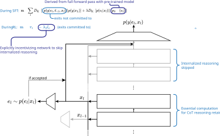

# Externalization via Early Exit Mechanisms

A framework for training language models to externalize their reasoning through early exit mechanisms, improving transparency and monitorability of Chain-of-Thought (CoT) reasoning.

## Overview

This repository implements a training procedure that incentivizes models to externalize their reasoning into interpretable CoT tokens.

By installing early exit mechanisms that allow models to stop computation at intermediate layers, we force models to serialize their reasoning externally rather than processing it across internal activations. This approach addresses the challenge of monitoring LLM reasoning for AI safety applications.

## How It Works

### Core Architecture

Our approach adds early exit mechanisms to pre-trained language models, allowing them to terminate computation at any intermediate layer and proceed directly to the final readout weights. The system operates in two distinct modes:

### Training Pipeline



1. **Supervised Fine-Tuning (SFT)**: Train early exit weights alongside LoRA adapters using the model's own pre-modification reasoning traces.

**Teacher Mode**: The original model generates reasoning traces and identifies optimal exit points during forward passes.

**Student Mode**: The modified model with early exit mechanisms learns to reproduce the teacher's reasoning while minimizing computational depth.


2. **Reinforcement Learning ** [WIP]: Further optimize exit timing with explicit rewards for earlier exits, forcing externalization of reasoning

### Technical Implementation

- **Early Exit Mechanism**: Stochastic scalar readout weights at each transformer layer determine exit probability
- **Architecture**: LoRA adapters applied to the main model with minimal computational overhead  
- **Residual Stream Freezing**: When early exit is triggered, the residual stream is frozen and passed directly to final readout weights
- **Training Target**: Joint optimization to reduce layer utilization while maintaining output quality
- **Model Patching**: Runtime patching of attention and model components without modifying original weights

## Repository Structure

```
externalization/
├── early_exit/           # Core early exit implementation
│   ├── patching/        # Model and attention layer modifications
│   ├── sft_train.py     # Supervised fine-tuning pipeline
│   └── util.py          # Utilities and helper functions
├── shared_utils/        # Common utilities for data processing and evaluation
├── teacher_data/        # Teacher model data generation notebooks
├── tests/              # Evaluation scripts and coherence testing
└── results_and_data/   # Training datasets and experimental results
```

### Basic Usage

**Train Early Exit Model**:
```python
python early_exit/sft_train.py --config config_deepseek.yaml
```

**Evaluate Results**:
```python
python tests/evaluate_early_exit.py
```


Output quality is assessed using a multi-dimensional coherence scoring system that evaluates:

- **Coherence and Logical Flow (1-10)**: Whether reasoning follows a sensible progression
- **Completeness of Reasoning (1-10)**: Whether the response reaches correct and explicit conclusions
- **Clarity and Readability (1-10)**: How easy the reasoning is to follow
- **Absence of Repetition/Errors (1-10)**: Penalizes contradictions and factual mistakes


### Demo

View interactive examples and visualizations: [Early Exit Demo](https://htmlpreview.github.io/?https://raw.githubusercontent.com/MeridianResearch/externalization/visualization/early_exit_teacher/visualizations/demo.html)


---


